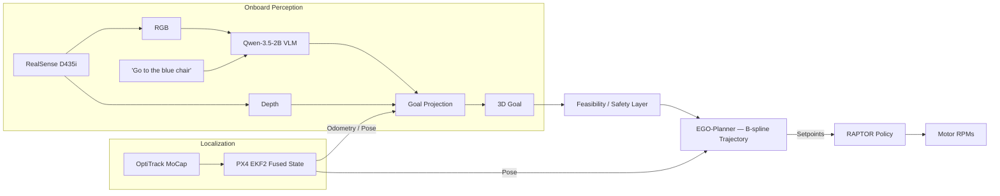

<div align="center">

# VLN on the Fly

### An Onboard Vision-Language Navigation Stack for Aerial Robots

Marco S. Tayar\*, Felipe Tommaselli\*, Gianluca Capezutto\*, Pedro Antonio Rabelo Saraiva\*,
Pedro H. V. de Freitas, Lucas Kido, Guilherme Sonego, Ricardo V. Godoy, Marcelo Becker

University of São Paulo (USP), Brazil · \*Equal contribution

[](https://vln-on-the-fly.github.io/)
[](https://vln-on-the-fly.github.io/)
[](https://docs.ros.org/en/humble/)

**🎉 Accepted at the International Micro Air Vehicle Conference (IMAV) 2026.**

[**🌐 Project page**](https://vln-on-the-fly.github.io/) &nbsp;·&nbsp; **📄 Paper** *(with the IMAV 2026 proceedings)*

</div>

---

> ⚠️ **Research prototype flown on real hardware.** This stack drives a quadrotor with props on. A finite-state safety layer gates every goal and trajectory, but you should read each package's README and understand the launch parameters before any autonomous flight, and validate sensor time-synchronization first.

<video src="https://github.com/peDrontonio/VLNontheFly/raw/main/media/VLN.mp4" controls width="100%"></video>

## Overview

Vision-language models (VLMs) have unlocked open-vocabulary, instruction-following navigation on many robot embodiments, but aerial robots have mostly been left out — limited onboard compute, hierarchical-integration complexity, and safety concerns get in the way. **VLN on the Fly** is a fully onboard, decoupled VLN stack for micro air vehicles:

- a **quantized VLM** grounds a natural-language instruction to a coarse image region,
- a **fast B-spline planner** turns that region into a collision-aware 3D trajectory over an onboard occupancy map, and
- a **pretrained cross-platform RL policy** tracks it directly to motor commands,

with a lightweight **finite-state-machine safety layer** validating and gating every stage. The decoupled design keeps grounding, planning, and control observable and independently inspectable — so failures can be attributed to a single stage rather than hidden inside an end-to-end policy.

## Highlights

| | |
|---|---|
| **0.87** | success rate (13 / 15 flights) |
| **5.72 cm** | mean goal error |
| **0.79 s** | median onboard VLM query (Jetson Orin NX) |
| **100%** | onboard compute — no offboard inference |

We deploy the full stack on a real UAV across **15 open-volume flights** across three everyday referents, and validate obstacle avoidance in **6 additional cluttered-environment trials** with collision-free trajectory tracking and safe perception gating.

## Pipeline



A single world-frame goal flows downstream through three replaceable stages, each checked by the safety layer before it is allowed to act:

1. **Grounding** — [`edgellm_vlm_ros`](./edgellm_vlm_ros) runs an INT4-quantized Qwen-3.5-2B over the live RGB stream and instruction, selecting a cell on a coarse 3×3 grid (or `STOP`) instead of free-form pixel coordinates. The cell is back-projected to a 3D point with aligned depth and camera intrinsics, then validated against the safe flight volume. Grounding at the cell level — rather than a single pixel — keeps the depth read-out valid and boundary-robust (a single pixel is invalid in 76–94% of frames).
2. **Planning** — [`ego-planner-swarm`](./ego-planner-swarm) (EGO-Planner) builds a local occupancy map from depth + pose and returns a collision-aware, dynamically feasible B-spline trajectory toward the goal, replanning continuously.
3. **Control** — RAPTOR, a small pretrained recurrent policy running on the Pixhawk, tracks the planner's position setpoints directly to motor commands, replacing the conventional position/attitude controller cascade with a single learned stage that transfers zero-shot across airframes.

## Results

Real-flight evaluation on a quadrotor with a Jetson Orin NX, Intel RealSense D435i, and Pixhawk 6C, over 15 flights from the same take-off pose, 5 per referent:

| Referent | Runs | Success ↑ | Goal err. (cm) ↓ | Track err. (cm) ↓ | Avg. GPU (%) |
|---|---:|---:|---:|---:|---:|
| Trash bin | 5 | 1.00 | 0.00 | 34.96 | 42.2 |
| Chair | 5 | 0.80 | 10.07 | 26.13 | 37.3 |
| Fire extinguisher | 5 | 0.80 | 7.08 | 37.64 | 38.4 |
| **Overall** | **15** | **0.87** | **5.72** | **32.91** | **39.3** |

Onboard VLM grounding latency on the Jetson Orin NX (N = 1865 queries):

| Stage | Median | 95th pct. | Max |
|---|---:|---:|---:|
| Time-to-first-token | 0.60 s | 0.66 s | 0.72 s |
| Total inference | 0.79 s | 0.88 s | 1.12 s |

In the cluttered trials, the same stack — unchanged — produced collision-free trajectories toward the referent, and the goal-validation interface degraded to a safe no-commit rather than an unsafe approach when grounding was uncertain. Full experimental setup, qualitative grounding/planning figures, ablations, and failure attribution are on the [project page](https://vln-on-the-fly.github.io/) and in the paper.

## Repository Layout

This repository doubles as a `colcon` workspace root — packages live directly under it rather than in a nested `src/`.

| Path | ROS 2 package(s) | Role |
|---|---|---|
| [`edgellm_vlm_ros`](./edgellm_vlm_ros) | `edgellm_vlm_ros` | TensorRT Edge-LLM VLM inference (point/region/primitive/supervised modes), goal gates, safety supervisor |
| [`ego-planner-swarm`](./ego-planner-swarm) | `ego_planner`, `plan_env`, `bspline_opt`, `path_searching`, `traj_utils`, `poscmd_2_odom`, `quadrotor_msgs`, … | EGO-Planner B-spline trajectory generation, occupancy mapping, `raptor_path_tracker.py` bridge to PX4 EXTERNAL mode |
| [`planner_wrapper`](./planner_wrapper) | `planner` | Experimental NavDP / iPlanner planner wrapper and trajectory demo assets (research alternative to EGO-Planner) |
| [`vio_bridge`](./vio_bridge) | `vio_bridge` | Visual-inertial odometry bridge, toward replacing the OptiTrack pose source with onboard localization |
| [`depth_estimator`](./depth_estimator) | `depth_estimator` | Monocular depth (Depth Anything V2) wrapper, alternative to RealSense stereo depth |
| [`mobile_flight`](./mobile_flight) | `mobile_gazebo`, `mobile_msgs` | PX4 offboard velocity control, Gazebo SITL simulation stack |
| [`realsense-ros`](./realsense-ros) | `realsense2_camera`, … | Vendored Intel RealSense ROS 2 driver |
| [`px4_msgs`](./px4_msgs) | `px4_msgs` | PX4 ROS 2 message definitions |

## Hardware

The validated setup is:

- Quadrotor airframe with a **Pixhawk 6C** flight controller running **PX4**
- **Jetson Orin NX** onboard computer (runs the quantized VLM, planner, and safety layer)
- **Intel RealSense D435i** RGB-D camera
- **OptiTrack PrimeX 41** motion-capture system for pose (current validation setup only — see the paper's Limitations and [`vio_bridge`](./vio_bridge) for the onboard-localization path)

## Installation

### Prerequisites

- Ubuntu 22.04 with **ROS 2 Humble**
- [PX4](https://px4.io/) firmware on the flight controller, with the Micro XRCE-DDS agent for ROS 2 ⟷ PX4 bridging
- Intel RealSense SDK (`librealsense2`) for [`realsense-ros`](./realsense-ros)
- A **TensorRT Edge-LLM** build for the quantized Qwen-3.5-2B engine used by `edgellm_vlm_ros`
- Python packages for `depth_estimator` (optional, only if using monocular depth instead of the D435i's stereo depth):

  ```bash
  pip install torch torchvision --index-url https://download.pytorch.org/whl/cu118
  pip install transformers accelerate pillow opencv-python-headless
  ```

### Build

```bash
git clone https://github.com/peDrontonio/VLNontheFly.git
cd VLNontheFly

source /opt/ros/humble/setup.bash
source /home/orin/ros2_ws/install/setup.bash   # your PX4 / Micro-XRCE-DDS workspace, if separate

# Camera, planner, and PX4 bridge
colcon build --packages-select \
  realsense2_camera plan_env ego_planner planner

# VLM package, built separately so its TensorRT options don't leak into other packages
colcon build --packages-select edgellm_vlm_ros \
  --cmake-args \
    -DEDGELLM_VLM_ENABLE_EDGELLM=ON \
    -DEDGELLM_SOURCE_DIR=/path/to/TensorRT-Edge-LLM \
    -DEDGELLM_BUILD_DIR=/path/to/TensorRT-Edge-LLM/build \
    -DTRT_PACKAGE_DIR=/usr

source install/setup.bash
```

## Running the Stack

Bring the stack up in stages — always with props off, disarmed, and PX4 `EXTERNAL` inactive first. The production launch is:

```bash
ros2 launch planner ego_raptor.launch.py \
  start_planner:=true \
  with_xrce:=true \
  with_optitrack:=true \
  with_realsense:=true \
  with_relative_goal:=true \
  set_external:=false
```

followed by the VLM in observation mode:

```bash
ros2 launch edgellm_vlm_ros d435i_vlm.launch.py \
  prompt_mode:=region \
  enable_region_gate:=true \
  region_gate_params_file:=install/edgellm_vlm_ros/share/edgellm_vlm_ros/config/region_gate.yaml
```

See each package's own README ([`edgellm_vlm_ros`](./edgellm_vlm_ros/README.md), [`mobile_flight`](./mobile_flight/README.md), [`depth_estimator`](./depth_estimator/README.md)) for mode-specific details, parameters, and simulation-only workflows. Validate RGB/depth/pose synchronization and the safety-gate behavior before enabling autonomous, VLM-triggered flight.

## Citation

```bibtex
@inproceedings{tayar2026vlnonthefly,
  title       = {{VLN} on the Fly: An Onboard Vision-Language Navigation Stack for Aerial Robots},
  author      = {Tayar, Marco S. and Tommaselli, Felipe and Capezutto, Gianluca and
                 Saraiva, Pedro Antonio Rabelo and de Freitas, Pedro H. V. and Kido, Lucas and
                 Sonego, Guilherme and Godoy, Ricardo V. and Becker, Marcelo},
  booktitle   = {International Micro Air Vehicle Conference and Competition (IMAV)},
  year        = {2026},
  institution = {University of S\~{a}o Paulo (USP), Brazil}
}
```

## License

TBD.

## Acknowledgments

This stack builds on [EGO-Planner](https://github.com/ZJU-FAST-Lab/ego-planner-swarm), the RAPTOR foundation control policy, Qwen for open-vocabulary grounding, PX4, and the Intel RealSense ROS 2 driver. Supported in part by FAPESP (grants #2025/20858-7, #2025/22381-3), CNPq (grant 308092/2020-1), and Petrobras.
