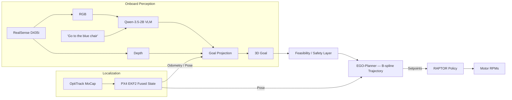

# VLN on the Fly

**A Fully Onboard Vision-Language Navigation Stack for Aerial Robots**

Marco S. Tayar\*, Felipe A. G. Tommaselli\*, Pedro Antonio Rabelo Saraiva\*, Gianluca Capezutto\*, Pedro H. V. de Freitas, Lucas Kido, Guilherme Sonego, Ricardo V. Godoy, Marcelo Becker
University of São Paulo (USP), Brazil · \*Equal contribution

[**Paper (PDF)**](./media/2026IMAV_VLN_on_the_Fly.pdf) &nbsp;|&nbsp; Submitted to **IMAV 2026** &nbsp;|&nbsp; ROS 2 Humble

> 🚧 **Research prototype, real hardware in the loop.** This stack flies a quadrotor. Read [`PRODUCTION_PIPELINE_RUNBOOK.md`](./PRODUCTION_PIPELINE_RUNBOOK.md) end to end — including its safety gates and current NO-GO conditions — before running anything on a vehicle with props on.

<video src="https://github.com/peDrontonio/VLNontheFly/raw/main/media/VLN.mp4" controls width="100%"></video>

## Overview

Vision-language models (VLMs) have unlocked open-vocabulary, instruction-following navigation on many robot embodiments, but aerial robots have mostly been left out because of limited onboard compute, hierarchical integration complexity, and safety concerns. **VLN on the Fly** is a fully onboard, decoupled VLN stack for micro air vehicles: a quantized VLM grounds a language instruction to a coarse image region, a fast B-spline planner turns that region into a collision-aware 3D trajectory, and a pretrained cross-platform RL policy tracks it to motor commands — with a lightweight finite-state-machine safety layer gating every stage.

Across 15 real onboard flights targeting three everyday objects (trash bin, chair, fire extinguisher), the stack reached the commanded referent in 13/15 trials, with 5.72 cm mean goal error and 32.91 cm mean trajectory-tracking error, all computed onboard.

## Table of Contents

- [Pipeline](#pipeline)
- [Results](#results)
- [Repository Layout](#repository-layout)
- [Hardware](#hardware)
- [Installation](#installation)
- [Running the Stack](#running-the-stack)
- [Citation](#citation)
- [License](#license)
- [Acknowledgments](#acknowledgments)

## Pipeline



A single world-frame goal flows downstream through three replaceable stages, each checked by the safety layer before it is allowed to act:

1. **Grounding** — [`edgellm_vlm_ros`](./edgellm_vlm_ros) runs an INT4-quantized Qwen-3.5-2B over the live RGB stream and instruction, selecting a cell on a coarse 3×3 grid (or `STOP`) instead of free-form pixel coordinates. The cell is back-projected to a 3D point with aligned depth and camera intrinsics, then validated against the safe flight volume.
2. **Planning** — [`ego-planner-swarm`](./ego-planner-swarm) (EGO-Planner) builds a local occupancy map from depth + pose and returns a collision-aware, dynamically feasible B-spline trajectory toward the goal, replanning continuously.
3. **Control** — RAPTOR, a small pretrained recurrent policy running on the Pixhawk, tracks the planner's position setpoints directly to motor commands, replacing the conventional position/attitude controller cascade with a single learned stage that transfers zero-shot across airframes.

See [`PRODUCTION_PIPELINE_RUNBOOK.md`](./PRODUCTION_PIPELINE_RUNBOOK.md) for the exact topic/frame graph, TF chain, and the current validation boundary (autonomous VLM-triggered flight is **NO-GO** until RGB/depth/pose timestamp synchronization lands — see that document for details).

## Results

Real-flight evaluation on a quadrotor with a Jetson Orin NX, Intel RealSense D435i, and Pixhawk 6C, over 15 flights from the same take-off pose, 5 per referent:

| Referent | Runs | Success ↑ | Goal err. (cm) ↓ | Track err. (cm) ↓ | Avg. GPU (%) |
|---|---:|---:|---:|---:|---:|
| Trash bin | 5 | 5/5 | 0.00 | 34.96 | 42.2 |
| Chair | 5 | 4/5 | 10.07 | 26.13 | 37.3 |
| Fire extinguisher | 5 | 4/5 | 7.08 | 37.64 | 38.4 |
| **Overall** | **15** | **13/15** | **5.72** | **32.91** | **39.3** |

Full experimental setup, qualitative grounding/planning figures, and failure attribution are in the [paper](./media/2026IMAV_VLN_on_the_Fly.pdf).

## Repository Layout

This repository doubles as a `colcon` workspace root — packages live directly under it rather than in a nested `src/`.

| Path | ROS 2 package(s) | Role |
|---|---|---|
| [`edgellm_vlm_ros`](./edgellm_vlm_ros) | `edgellm_vlm_ros` | TensorRT Edge-LLM VLM inference (point/region/primitive/supervised modes), goal gates, safety supervisor |
| [`ego-planner-swarm`](./ego-planner-swarm) | `ego_planner`, `plan_env`, `bspline_opt`, `path_searching`, `traj_utils`, `poscmd_2_odom`, `quadrotor_msgs`, … | EGO-Planner B-spline trajectory generation, occupancy mapping, `raptor_path_tracker.py` bridge to PX4 EXTERNAL mode |
| [`planner_wrapper`](./planner_wrapper) | `planner` | Experimental NavDP / iPlanner planner wrapper and trajectory demo assets (research alternative to EGO-Planner) |
| [`vio_bridge`](./vio_bridge) | `vio_bridge` | Visual-inertial odometry bridge, toward replacing the OptiTrack pose source with onboard localization |
| [`depth_estimator`](./depth_estimator) | `depth_estimator` | Monocular depth (Depth Anything V2) wrapper, alternative to RealSense stereo depth |
| [`mobile_flight`](./mobile_flight) | `mobile_gazebo`, `mobile_msgs` | PX4 offboard velocity control, Gazebo SITL simulation stack |
| [`realsense-ros`](./realsense-ros) | `realsense2_camera`, … | Vendored Intel RealSense ROS 2 driver |
| [`px4_msgs`](./px4_msgs) | `px4_msgs` | PX4 ROS 2 message definitions |

Key docs:

- [`PRODUCTION_PIPELINE_RUNBOOK.md`](./PRODUCTION_PIPELINE_RUNBOOK.md) — full bring-up, verification, and go/no-go checklist for the production stack
- [`PRODUCTION_FRAME_TEST_RECORD.md`](./PRODUCTION_FRAME_TEST_RECORD.md) — recorded frame/TF validation results

## Hardware

The validated setup (see paper Section 4) is:

- Quadrotor airframe with a **Pixhawk 6C** flight controller running **PX4**
- **Jetson Orin NX** onboard computer (runs the quantized VLM, planner, and safety layer)
- **Intel RealSense D435i** RGB-D camera
- **OptiTrack PrimeX 41** motion-capture system for pose (current validation setup only — see the paper's Limitations and [`vio_bridge`](./vio_bridge) for the onboard-localization path)

## Installation

### Prerequisites

- Ubuntu 22.04 with **ROS 2 Humble**
- [PX4](https://px4.io/) firmware on the flight controller, with Micro XRCE-DDS agent for ROS 2 <-> PX4 bridging
- Intel RealSense SDK (`librealsense2`) for [`realsense-ros`](./realsense-ros)
- **TensorRT-Edge-LLM** build for the quantized Qwen-3.5-2B engine used by `edgellm_vlm_ros` <!-- TODO: link the TensorRT-Edge-LLM source used on the Jetson -->
- Python packages for `depth_estimator` (optional, only if using monocular depth instead of the D435i's stereo depth):

  ```bash
  pip install torch torchvision --index-url https://download.pytorch.org/whl/cu118
  pip install transformers accelerate pillow opencv-python-headless
  ```

### Build

```bash
git clone https://github.com/peDrontonio/VLNontheFly.git
cd VLNontheFly

source /opt/ros/humble/setup.bash
source /home/orin/ros2_ws/install/setup.bash   # your PX4/Micro-XRCE-DDS workspace, if separate

# Camera, planner, and PX4 bridge
colcon build --packages-select \
  realsense2_camera plan_env ego_planner planner

# VLM package, built separately so its TensorRT options don't leak into other packages
colcon build --packages-select edgellm_vlm_ros \
  --cmake-args \
    -DEDGELLM_VLM_ENABLE_EDGELLM=ON \
    -DEDGELLM_SOURCE_DIR=/path/to/TensorRT-Edge-LLM \
    -DEDGELLM_BUILD_DIR=/path/to/TensorRT-Edge-LLM/build \
    -DTRT_PACKAGE_DIR=/usr

source install/setup.bash
```

## Running the Stack

The full bring-up — environment variables, staged verification (synthetic tests, TF chain, physical obstacle placement), Foxglove visualization, and the go/no-go criteria before any autonomous flight — is documented step by step in [`PRODUCTION_PIPELINE_RUNBOOK.md`](./PRODUCTION_PIPELINE_RUNBOOK.md). Start there rather than improvising a launch sequence.

At a glance, the production launch (props off, disarmed, `EXTERNAL` inactive) is:

```bash
ros2 launch planner ego_raptor.launch.py \
  start_planner:=true \
  with_xrce:=true \
  with_optitrack:=true \
  with_realsense:=true \
  with_relative_goal:=true \
  set_external:=false
```

followed by the VLM in observation mode:

```bash
ros2 launch edgellm_vlm_ros d435i_vlm.launch.py \
  prompt_mode:=region \
  enable_region_gate:=true \
  region_gate_params_file:=install/edgellm_vlm_ros/share/edgellm_vlm_ros/config/region_gate.yaml
```

See each package's own README ([`edgellm_vlm_ros`](./edgellm_vlm_ros/README.md), [`mobile_flight`](./mobile_flight/README.md), [`depth_estimator`](./depth_estimator/README.md)) for mode-specific details and simulation-only workflows.

## Citation

The paper is currently under review at IMAV 2026; the entry below will be updated once a final venue/DOI is assigned.

```bibtex
@inproceedings{tayar2026vlnonthefly,
  title     = {{VLN} on the Fly: A Fully Onboard Vision-Language Navigation Stack for Aerial Robots},
  author    = {Tayar, Marco S. and Tommaselli, Felipe A. G. and Saraiva, Pedro Antonio Rabelo and
               Capezutto, Gianluca and de Freitas, Pedro H. V. and Kido, Lucas and Sonego, Guilherme and
               Godoy, Ricardo V. and Becker, Marcelo},
  booktitle = {International Micro Air Vehicle Conference and Competition (IMAV)},
  year      = {2026},
  note      = {Under review},
  institution = {University of S\~{a}o Paulo (USP), Brazil}
}
```

## License

TBD.

## Acknowledgments

This stack builds on [EGO-Planner](https://github.com/ZJU-FAST-Lab/ego-planner-swarm), the RAPTOR foundation control policy, Qwen for open-vocabulary grounding, PX4, and the Intel RealSense ROS 2 driver.
